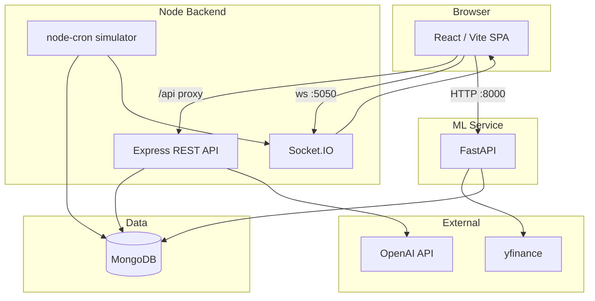

# NeuralTrade — AI-Powered Trading Intelligence Platform

> Institutional-grade trading simulation platform with real-time market data, 
> AI-driven portfolio analytics, time-series price forecasting, and LLM-generated insights.

---

## Overview

NeuralTrade is a full-stack AI-powered trading intelligence platform built for 
real-time market simulation, portfolio management, and predictive analytics. 
It combines a Node.js backend, a Python ML microservice, and a React dashboard 
to deliver an institutional-grade trading experience.

The platform was built as a portfolio project to demonstrate end-to-end 
software engineering skills across full-stack web development, machine learning, 
real-time systems, and AI integration.

---

## Live Features

- Real-time candlestick charts with WebSocket price feeds (<300ms latency)
- AI-powered price forecasting using Prophet and LSTM models (65-70% directional accuracy)
- Portfolio simulation with $100,000 virtual capital
- Risk analytics: Sharpe Ratio, Value at Risk (95%), Max Drawdown
- Technical signals: RSI(14), MACD(12,26,9), Bollinger Bands
- LLM-generated trade commentary via OpenAI GPT-4o-mini
- 7-screen dark UI: Login, Dashboard, Trade, Portfolio, AI Insights, Risk Analytics, Trade History
- Live ticker tape with real market prices
- JWT authentication with secure session management

---

## Tech Stack

### Frontend
| Technology | Purpose |
|---|---|
| React 18 + Vite | UI framework and build tool |
| Tailwind CSS v4 | Styling and design system |
| lightweight-charts | TradingView candlestick charts |
| Recharts | Portfolio donut charts and analytics |
| Socket.io-client | Real-time WebSocket price updates |
| React Router v6 | Client-side navigation |

### Backend
| Technology | Purpose |
|---|---|
| Node.js v22 + Express | REST API server |
| Socket.io | WebSocket server for live price emission |
| Mongoose + MongoDB | Database ORM and storage |
| JWT + bcryptjs | Authentication and password hashing |
| node-cron | Scheduled market data simulation |
| OpenAI SDK | GPT-4o-mini trade commentary |

### ML Service
| Technology | Purpose |
|---|---|
| Python 3.11 + FastAPI | ML microservice API |
| Prophet | Time-series price forecasting |
| PyTorch (MPS) | LSTM model training on Apple Silicon |
| scikit-learn | Model evaluation and preprocessing |
| yfinance | Real market data fetching |
| pandas + numpy | Data processing and analytics |

---

## Architecture

| Layer | Path | Responsibility |
|-------|------|----------------|
| Frontend | `frontend/` | NeuralTrade UI, charts, routing, JWT in `localStorage`, virtual cash for paper trades |
| Backend | `backend/` | Auth, portfolio CRUD, market candle queries, Socket.IO `candle` events, simulated OHLCV |
| ML service | `ml-service/` | Live prices, Prophet/LSTM workflows, risk metrics, technical signals |
| Config | `.env` (repo root) | `MONGODB_URI`, `JWT_SECRET`, `PORT`, `OPENAI_API_KEY`, `ML_SERVICE_URL` |

---

## Quick start

1. **MongoDB** — running locally or remote; set `MONGODB_URI` in `.env`.
2. **Backend** — `cd backend && npm install && npm start` (default `PORT` in `.env`, often `5050`).
3. **ML service** — `cd ml-service && python -m venv .venv && source .venv/bin/activate && pip install -r requirements.txt && uvicorn main:app --host 0.0.0.0 --port 8000`
4. **Frontend** — `cd frontend && npm install && npm run dev` — open the Vite URL (e.g. `http://localhost:5173`).

Register or sign in, then use Dashboard, Trade, Portfolio, and AI routes. Ensure ports **5050** (API), **8000** (ML), and **5173** (Vite) are free; on macOS, port **5000** is often used by AirPlay—use **5050** in `.env` if needed.
